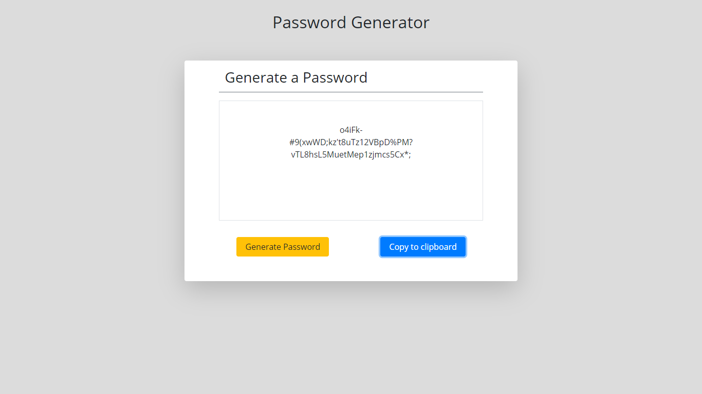

# 03-Password-Generator
Generate a random password based on user input

### Table of Contents
- [Description](#Description)
- [Concepts](#Concepts)
- [Technologies](#Technologies)
- [Lanuages-Used](#Languages-Used)
- [Screenshot](#Screenshot)
- [Link](#Link)
- [Resources](#Resources)

### Description

My first assignment using JavaScript.

Using the onclick() functionality of HTML, the grid system of Bootstrap, and JavaScript, I created an application which allows the user to run two functions : one to generate a password, and one to copy the password to clipboard.  For the generated password, the user is prompted some parameters for the password: length and character type.

In my program, I used nested Arrays, but upon reflection I realized Objects would have functioned better if this were a collaborative project.

### Concepts

##### Loops

    ..* For loops and while loops allowed me to iterate through the same functionality based on conditions.

##### If/Else Statements

    ..* If/Else statements allows me to run code based on conditions.

##### Functions

    ..* Functions allow us to create modules of code which can be reused throughout the program.  Functions also help with organization and efficency from a UX perspective.

##### HTML and JavaScript communication

### Technologies

- [Bootstrap](https://getbootstrap.com/) - CSS Framework
- [Flexbox](https://developer.mozilla.org/en-US/docs/Learn/CSS/CSS_layout/Flexbox) - Resource used within Bootstrap

### Languages Used

- HTML
- CSS
- JavaScript

### Screenshot

### Link

Deployed Webpage

https://astrobeef.github.io/03-Password-Generator/index.html

### Resources

https://w3schools.com

https://getbootstrap.com/docs/4.1/getting-started/introduction/

https://developer.mozilla.org/en-US/docs/Web/JavaScript/Reference/Global_Objects/Array/isArray

https://stackoverflow.com/questions/175739/built-in-way-in-javascript-to-check-if-a-string-is-a-valid-number

http://www.asciitable.com/
